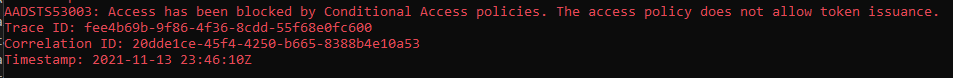
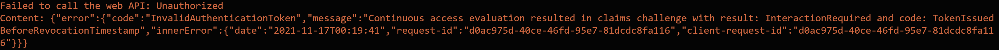

# A .NET Core daemon app authenticating as itself using client credentials to call Graph and handling CAE events

 1. [Overview](#overview)
 1. [Scenario](#scenario)
 1. [Contents](#contents)
 1. [Prerequisites](#prerequisites)
 1. [Setup](#setup)
 1. [Registration](#registration)
 1. [Running the sample](#running-the-sample)
 1. [Explore the sample](#explore-the-sample)
 1. [About the code](#about-the-code)
 1. [Deployment](#deployment)
 1. [More information](#more-information)
 1. [Community Help and Support](#community-help-and-support)
 1. [Contributing](#contributing)


## Overview

This sample application shows how to use the [Microsoft identity platform endpoint](https://aka.ms/aadv2) to access the data of Microsoft business customers in a long-running, non-interactive process.  It uses the [OAuth 2 client credentials grant](https://docs.microsoft.com/azure/active-directory/develop/v2-oauth2-client-creds-grant-flow) to acquire an access token, which it uses to then call the [Microsoft Graph](https://graph.microsoft.io) and access organizational data. This flow of authentication is also sometimes referred to as **Service Principal (SP) authentication**.  

Additionally, the sample shows developers how to enable [Continuous access evaluation\(CAE\)](https://aka.ms/cae) in a tenant and use a [Conditional Access\(CA\)](https://docs.microsoft.com/azure/active-directory/conditional-access/) policy to enforce CAE events for this application.

## Scenario

The app is a .NET Core Console application. It gets the list of users from MS Graph in an Azure AD tenant by using Microsoft Authentication Library for .NET ([MSAL.NET](https://aka.ms/msal-net)) to acquire a token for MS Graph.

We then [enable CAE](https://docs.microsoft.com/azure/active-directory/conditional-access/concept-continuous-access-evaluation#enable-or-disable-cae-preview) for the tenant and a CA policy created/updated to apply CAE events for this application's [Service Principal](https://aka.ms/serviceprincipal). 

The order of processing is roughly as follows:

- The console app first authenticates as itself (using the [Client Credentials flow](https://docs.microsoft.com/azure/active-directory/develop/v2-oauth2-client-creds-grant-flow)) and gets an [Access Token](https://aka.ms/access-tokens) from Azure AD for Microsoft Graph.
- It then calls the MS Graph API to fetch a list of users in a loop of 5 seconds.
- the developer can then use the provided steps to disable the Service Principal (SP) of this app. This raises a CAE event for MS Graph.
- Once the SP is disabled, MS Graph will then reject the Access Token even though its still within its validity.


## Prerequisites

- [Visual Studio](https://aka.ms/vsdownload) or newer, or just the [.NET Core SDK](https://www.microsoft.com/net/learn/get-started)
- An Internet connection
- A Windows machine (necessary if you want to run the app on Windows)
- An OS X machine (necessary if you want to run the app on Mac)
- A Linux machine (necessary if you want to run the app on Linux)
- An Azure Active Directory (Azure AD) tenant. For more information on how to get an Azure AD tenant, see [How to get an Azure AD tenant](https://azure.microsoft.com/documentation/articles/active-directory-howto-tenant/)
- A user account in your Azure AD tenant to make the app registration.

For more information on the concepts used in this sample, be sure to read the [Microsoft identity platform endpoint client credentials protocol documentation](https://azure.microsoft.com/documentation/articles/active-directory-v2-protocols-oauth-client-creds).

- Developers who wish to gain good familiarity of programming for Microsoft Graph are advised to go through the [An introduction to Microsoft Graph for developers](https://www.youtube.com/watch?v=EBbnpFdB92A) recorded session.

## Setup

### Step 1:  Clone or download this repository

From your shell or command line:

```console
git clone https://github.com/Azure-Samples/ms-identity-dotnetcore-daemon-graph-cae.git
```

or download and extract the repository .zip file.

> :warning: To avoid path length limitations on Windows, we recommend cloning into a directory near the root of your drive.

### Step 2: Install project dependencies

```console
    dotnet restore
```

### Register the sample application(s) with your Azure Active Directory tenant

There is one project in this sample. To register it, you can:

- follow the steps below for manually register your apps
- or use PowerShell scripts that:
  - **automatically** creates the Azure AD applications and related objects (passwords, permissions, dependencies) for you.
  - modify the projects' configuration files.

<details>
  <summary>Expand this section if you want to use this automation:</summary>

> :warning: If you have never used **Azure AD Powershell** before, we recommend you go through the [App Creation Scripts](./AppCreationScripts/AppCreationScripts.md) once to ensure that your environment is prepared correctly for this step.

1. On Windows, run PowerShell as **Administrator** and navigate to the root of the cloned directory
1. If you have never used Azure AD Powershell before, we recommend you go through the [App Creation Scripts](./AppCreationScripts/AppCreationScripts.md) once to ensure that your environment is prepared correctly for this step.
1. In PowerShell run:

   ```PowerShell
   Set-ExecutionPolicy -ExecutionPolicy RemoteSigned -Scope Process -Force
   ```

1. Run the script to create your Azure AD application and configure the code of the sample application accordingly.
1. In PowerShell run:

   ```PowerShell
   cd .\AppCreationScripts\
   .\Configure.ps1
   ```

   > Other ways of running the scripts are described in [App Creation Scripts](./AppCreationScripts/AppCreationScripts.md)
   > The scripts also provide a guide to automated application registration, configuration and removal which can help in your CI/CD scenarios.

</details>

### Choose the Azure AD tenant where you want to create your applications

As a first step you'll need to:

1. Sign in to the [Azure portal](https://portal.azure.com).
1. If your account is present in more than one Azure AD tenant, select your profile at the top right corner in the menu on top of the page, and then **switch directory** to change your portal session to the desired Azure AD tenant.

### Register the client app (daemon-console-cae)

1. Navigate to the [Azure portal](https://portal.azure.com) and select the **Azure AD** service.
1. Select the **App Registrations** blade on the left, then select **New registration**.
1. In the **Register an application page** that appears, enter your application's registration information:
   - In the **Name** section, enter a meaningful application name that will be displayed to users of the app, for example `daemon-console-cae`.
   - Under **Supported account types**, select **Accounts in this organizational directory only**.
   - In the **Redirect URI (optional)** section, select **Web** in the combo-box.
   - For the *Redirect URI*, enter `https://<your_tenant_name>/daemon-console-cae`, replacing `<your_tenant_name>` with the name of your **Azure AD** tenant.
1. Select **Register** to create the application.
1. In the app's registration screen, find and note the **Application (client) ID**. You use this value in your app's configuration file(s) later in your code.
1. Select **Save** to save your changes.
1. In the app's registration screen, select the **Certificates & secrets** blade in the left to open the page where you can generate secrets and upload certificates.
1. In the **Client secrets** section, select **New client secret**:
   - Type a key description (for instance `app secret`),
   - Select one of the available key durations (**6 months**, **12 months** or **Custom**) as per your security posture.
   - The generated key value will be displayed when you select the **Add** button. Copy and save the generated value for use in later steps.
   - You'll need this key later in your code's configuration files. This key value will not be displayed again, and is not retrievable by any other means, so make sure to note it from the Azure portal before navigating to any other screen or blade.
    > :bulb: For enhanced security, consider [using certificates](https://github.com/AzureAD/microsoft-identity-web/wiki/Certificates) instead of client secrets.
1. In the app's registration screen, select the **API permissions** blade in the left to open the page where we add access to the APIs that your application needs.
   - Select the **Add a permission** button and then,
   - Ensure that the **Microsoft APIs** tab is selected.
   - In the *Commonly used Microsoft APIs* section, select **Microsoft Graph**
   - In the **Application permissions** section, select the **User.Read.All** in the list. Use the search box if necessary.
   - Select the **Add permissions** button at the bottom.

1. At this stage, the permissions are assigned correctly but since the client app does not allow users to interact, the users' themselves cannot consent to these permissions. 
   To get around this problem, we'd let the [tenant administrator consent on behalf of all users in the tenant](https://docs.microsoft.com/azure/active-directory/develop/v2-admin-consent).
   Select the **Grant admin consent for {tenant}** button, and then select **Yes** when you are asked if you want to grant consent for the requested permissions for all account in the tenant. You need to be an the tenant admin to be able to carry out this operation.

#### Configure the client app (daemon-console-cae) to use your app registration

Open the project in your IDE (like Visual Studio or Visual Studio Code) to configure the code.

> In the steps below, "ClientID" is the same as "Application ID" or "AppId".

1. Open the `daemon-console\appsettings.json` file.
1. Find the key `Tenant` and replace the existing value with your Azure AD tenant name.
1. Find the key `ClientId` and replace the existing value with the application ID (clientId) of `daemon-console-cae` app copied from the Azure portal.
1. Find the key `ClientSecret` and replace the existing value with the key you saved during the creation of `daemon-console-cae` copied from the Azure portal.

## Running the sample

> For Visual Studio Users
>
> Clean the solution, rebuild the solution, and run it.  

```console
    cd daemon-console
    dotnet run
```

Start the application, it will display the users in the tenant.

## Testing CAE events

[Continues Access Evaluation](https://docs.microsoft.com/azure/active-directory/conditional-access/concept-continuous-access-evaluation) can now be tested by adding the Service Principal of this app to a Conditional Access policy and then disabling the Service Principal via PowerShell to raise the CAE event.

### Create/Update a Conditional Access policy] for this app and CAE events

1. Go to Azure Active Directory
1. Open Security/Conditional Access
1. Select "New Policy" from upper menu
1. Fill Name field
1. Under "Assignments" select "Workload Identities" and click "Select service principals" radio button
1. You can either use "Edit filter" for advanced option or just "Select" to choose a Service Principal(s) by name
   > Note: only single tenant service principals are supported by this time.
1. Cloud apps or actions - choose "All cloud apps"
1. Access Controls - select Grant/Block
1. Enable policy - set it to On
1. Press "Create" button
1. Run daemon application and observe the terminal. After some time you will start seeing error like this: 
1. To stop this behavior you either turn the policy Off or delete it. Then after some time the terminal will start displaying Graph data as usual.

### Declaring Client Capability

Azure AD and the CAE enabled resources, like MS Graph in this example, would not raise CAE events unless the client (this app) declares itself to be capable of handling CAE events.
This is done by sending a [client capability](https://docs.microsoft.com/azure/active-directory/develop/claims-challenge#client-capabilities) declaration to Azure AD.

The following code is added.

[TODO]

Once the client application announces that its capable, two changes take place:

1. Azure AD sends an Access Token for MS Graph which is valid for 24 hours instead of the standard 1 hour.
1. MS graph will receive CAE events and can potentially reject a valid Access token from a capable client if a CAA event occurs.

### Checking CAE by disabling Service Principal

1. Run the application and make sure you get users graph data in continues manner. Leave the application in running state.
1. Open PowerShell as Administrator.
1. Use the following set of PowerShell commands to locate and disable the Service Principal of this application

   ```PowerShell
   # install the Azure AD powershell if not already present
   Install-Module AzureAD

   # Connect to your Azure AD tenant
   Connect-AzureAD -TenantId <your tenantid>

   # locate the Service Principal of this app, copy its object id
   Get-AzureADServicePrincipal -SearchString "daemon-console-cae"

   # Disable the service principal of this app
   Set-AzureADServicePrincipal -ObjectId \<Id\> -AccountEnabled $False
   ```

>if you're using an Azure environment other than global, like PPE, use [-AzureEnvironmentName AzurePPE](https://docs.microsoft.com/powershell/module/azuread/connect-azuread)

1. Observe the daemon application terminal and note that after some time you will start getting next error 
1.You can re-test this scenario by re-enabling the Service Principal using the following command.

   ```PowerShell

   # Disable the service principal of this app
   Set-AzureADServicePrincipal -ObjectId \<Id\> -AccountEnabled $True
   ```

## About the code

The relevant code for this sample is in the `Program.cs` file, in the `RunAsync()` method. The steps are:

1. Create the MSAL confidential client application.

    Important note: even if we are building a console application, it is a daemon, and therefore a confidential client application, as it does not
    access Web APIs on behalf of a user, but on its own application behalf.

    ```CSharp
    IConfidentialClientApplication app;
    app = ConfidentialClientApplicationBuilder.Create(config.ClientId)
                                              .WithClientSecret(config.ClientSecret)
                                              .WithAuthority(new Uri(config.Authority))
                                              .Build();
    ```

2. Define the scopes.

   Specific to client credentials, you don't specify, in the code, the individual scopes you want to access. You have statically declared
   them during the application registration step. Therefore the only possible scope is "resource/.default" (here "https://graph.microsoft.com/.default")
   which means "the static permissions defined in the application"

    ```CSharp
    // With client credentials flows the scopes is ALWAYS of the shape "resource/.default", as the 
    // application permissions need to be set statically (in the portal or by PowerShell), and then granted by
    // a tenant administrator
    string[] scopes = new string[] { "https://graph.microsoft.com/.default" };
    ```

3. Acquire the token

    ```CSharp
    AuthenticationResult result = null;
    try
    {
        result = await app.AcquireTokenForClient(scopes)
                          .ExecuteAsync();
    }
    catch(MsalServiceException ex)
    {
        // AADSTS70011
        // Invalid scope. The scope has to be of the form "https://resourceurl/.default"
        // Mitigation: this is a dev issue. Change the scope to be as expected
    }
    ```

4. Call the API

    In that case calling "https://graph.microsoft.com/v1.0/users" with the access token as a bearer token.

## Troubleshooting

### Did you forget to provide admin consent? This is needed for daemon apps

If you get an error when calling the API `Insufficient privileges to complete the operation.`, this is because the tenant administrator has not granted permissions
to the application. See step 6 of [Register the client app (daemon-console-cae)](#register-the-client-app-daemon-console-cae) above.

You will typically see, on the output window, something like the following:

```Json
Failed to call the Web Api: Forbidden
Content: {
  "error": {
    "code": "Authorization_RequestDenied",
    "message": "Insufficient privileges to complete the operation.",
    "innerError": {
      "request-id": "<a guid>",
      "date": "<date>"
    }
  }
}
```


## Community Help and Support

Use [Stack Overflow](http://stackoverflow.com/questions/tagged/msal) to get support from the community.
Ask your questions on Stack Overflow first and browse existing issues to see if someone has asked your question before.
Make sure that your questions or comments are tagged with [`msal` `dotnet`].

If you find a bug in the sample, please raise the issue on [GitHub Issues](../../issues).

If you find a bug in msal.Net, please raise the issue on [MSAL.NET GitHub Issues](https://github.com/AzureAD/microsoft-authentication-library-for-dotnet/issues).

To provide a recommendation, visit the following [User Voice page](https://feedback.azure.com/forums/169401-azure-active-directory).

## Contributing

If you'd like to contribute to this sample, see [CONTRIBUTING.MD](/CONTRIBUTING.md).

This project has adopted the [Microsoft Open Source Code of Conduct](https://opensource.microsoft.com/codeofconduct/). For more information, see the [Code of Conduct FAQ](https://opensource.microsoft.com/codeofconduct/faq/) or contact [opencode@microsoft.com](mailto:opencode@microsoft.com) with any additional questions or comments.

## More information

For more information, see MSAL.NET's conceptual documentation:

- [Quickstart: Register an application with the Microsoft identity platform](https://docs.microsoft.com/azure/active-directory/develop/quickstart-register-app)
- [Quickstart: Configure a client application to access web APIs](https://docs.microsoft.com/azure/active-directory/develop/quickstart-configure-app-access-web-apis)
- [Acquiring a token for an application with client credential flows](https://aka.ms/msal-net-client-credentials)

For more information about the underlying protocol:

- [Microsoft identity platform and the OAuth 2.0 client credentials flow](https://docs.microsoft.com/azure/active-directory/develop/v2-oauth2-client-creds-grant-flow)

For a more complex multi-tenant Web app daemon application, see [active-directory-dotnet-daemon-v2](https://github.com/Azure-Samples/active-directory-dotnet-daemon-v2)